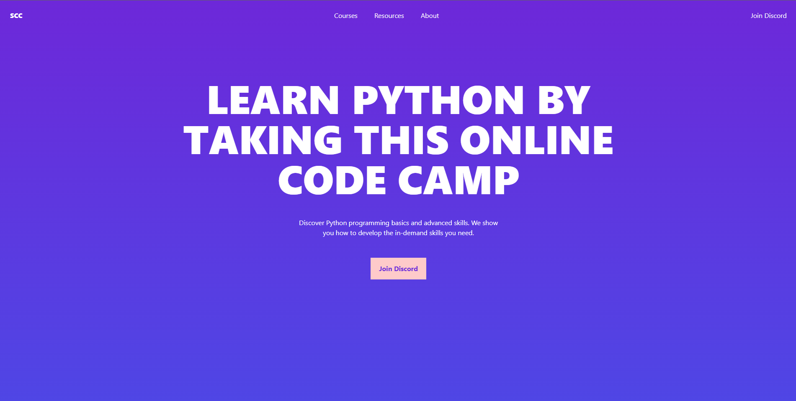

# SCC

A website for summer code camp (scc) that teaches Python Programming Language. This was used to learn TailwindCSS.

> **Features to be Implemented**

* Make the website responsive
* Add animation
  
**Home Page**
 
  
## Tech Stack

* HTML
* TailwindCSS
